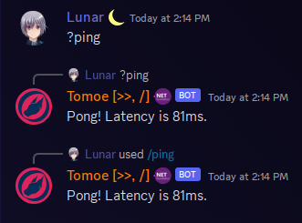

# Commands Introduction
`DSharpPlus.Commands` is a new universal command framework designed with a "write-once, use-anywhere" mindset. Previously when developing bots with DSharpPlus, you'd have to choose between text commands through `DSharpPlus.CommandsNext`, or slash commands through `DSharpPlus.SlashCommands`. With `DSharpPlus.Commands`, you can have both. This framework is designed to be easy to use, and easy to extend.

## Hello World

First, we're going to setup our code.

# [Main Method](#tab/main-method)
```cs
public async Task Main(string[] args)
{
    string discordToken = Environment.GetEnvironmentVariable("DISCORD_TOKEN");
    if (string.IsNullOrWhiteSpace(discordToken))
    {
        Console.WriteLine("Error: No discord token found. Please provide a token via the DISCORD_TOKEN environment variable.");
        Environment.Exit(1);
    }

    DiscordClientBuilder builder = DiscordClientBuilder.CreateDefault(discordToken, TextCommandProcessor.RequiredIntents | SlashCommandProcessor.RequiredIntents);
    DiscordClient discordClient = builder.Build();

    // Use the commands extension
    CommandsExtension commandsExtension = discordClient.UseCommands(new CommandsConfiguration()
    {
        ServiceProvider = serviceProvider,
        DebugGuildId = Environment.GetEnvironmentVariable("DEBUG_GUILD_ID") ?? 0,
        // The default value, however it's shown here for clarity
        RegisterDefaultCommandProcessors = true
    });

    // Add all commands by scanning the current assembly
    commandsExtension.AddCommands(typeof(Program).Assembly);
    TextCommandProcessor textCommandProcessor = new(new()
    {
        // The default behavior is that the bot reacts to direct mentions
        // and to the "!" prefix.
        // If you want to change it, you first set if the bot should react to mentions
        // and then you can provide as many prefixes as you want.
        PrefixResolver = new DefaultPrefixResolver(true, "?", "&").ResolvePrefixAsync
    });

    // Add text commands with a custom prefix (?ping)
    await commandsExtension.AddProcessorsAsync(textCommandProcessor);
}
```

# [Service Provider](#tab/service-provider)
In the main logic of your program, we're going to register the `DiscordClient` to your service provider. I've chosen to do it like such:

```cs
string discordToken = Environment.GetEnvironmentVariable("DISCORD_TOKEN");

if (string.IsNullOrWhiteSpace(discordToken))
{
    Console.WriteLine("Error: No discord token found. Please provide a token via the DISCORD_TOKEN environment variable.");
    Environment.Exit(1);
}

serviceCollection.AddDiscordClient(discordToken, TextCommandProcessor.RequiredIntents | SlashCommandProcessor.RequiredIntents);
```

And when your program actually starts, you'll want to register the command framework:

```cs
DiscordClient discordClient = serviceProvider.GetRequiredService<DiscordClient>();

// Register extensions outside of the service provider lambda since these involve asynchronous operations
CommandsExtension commandsExtensions = discordClient.UseCommands(new CommandsConfiguration()
{
    ServiceProvider = serviceProvider,
    DebugGuildId = Environment.GetEnvironmentVariable("DEBUG_GUILD_ID") ?? 0,
    // The default value, however it's shown here for clarity
    RegisterDefaultCommandProcessors = true
});

// Add all commands by scanning the current assembly
commandsExtension.AddCommands(typeof(Program).Assembly);
TextCommandProcessor textCommandProcessor = new(new()
{
    // The default behavior is that the bot reacts to direct mentions
    // and to the "!" prefix.
    // If you want to change it, you first set if the bot should react to mentions
    // and then you can provide as many prefixes as you want.
    PrefixResolver = new DefaultPrefixResolver(true, "?", "&").ResolvePrefixAsync
});

// Add text commands with a custom prefix (?ping)
await commandsExtension.AddProcessorsAsync(textCommandProcessor);

```

---

Let's break this down a bit:
- We use each processor's required intents to ensure that the extension receives the necessary gateway events and data to function properly.
- We register all the commands in our bot by passing the bot's assembly to `AddCommands`. This will scan the assembly for any classes (group commands) or methods that have the `Command` attribute, and register them as commands.
- We register the `TextCommandProcessor` processor with a custom prefix resolver.

What in the world is a command processor? In order to execute a command, we need to be able to parse the input. Text commands are regular old Discord messages, while slash commands are a special type of event that Discord sends to your bot. The `TextCommandProcessor` and `SlashCommandProcessor` are responsible for parsing these inputs and determining which command to execute. By default, all processors are registered with the command framework. You can add/create your own processors if you need to.

## Creating A Command

Now that we have the command framework registered and configured, we can create our first command:

```cs
public class PingCommand
{
    [Command("ping")]
    public static ValueTask ExecuteAsync(CommandContext context) => context.RespondAsync($"Pong! Latency is {context.Client.Ping}ms.");
}
```

There's multiple things to note here:
- There is no longer a `BaseCommandModule` class to inherit from. This is because the command framework is now attribute-based.
- Your commands may now be `static`.
- Your command return type may now be `ValueTask` or `Task`, instead of only limiting to `Task`.
- By default, any response made via `CommandContext` will not mention any user or role - those mentions must be specified manually by using a `DiscordMessageBuilder`.

Now start your Discord client, and type `!ping` in a text channel. Your bot should respond with "Pong! Latency is {Number}ms."



## Creating a Group Command
Creating a group command isn't much different:

```cs
[Command("math")]
public class MathCommands
{
    [Command("add")]
    public static ValueTask AddAsync(CommandContext context, int a, int b) => context.RespondAsync($"{a} + {b} = {a + b}");

    [Command("subtract")]
    public static ValueTask SubtractAsync(CommandContext context, int a, int b) => context.RespondAsync($"{a} - {b} = {a - b}");
}
```

You can invoke these commands by typing `!math add 5 3` or `!math subtract 5 3` in a text channel.
