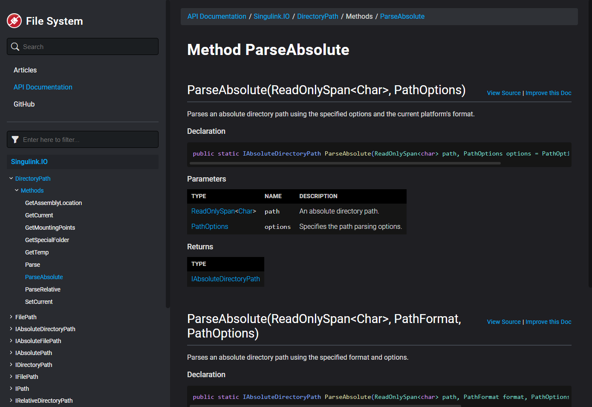
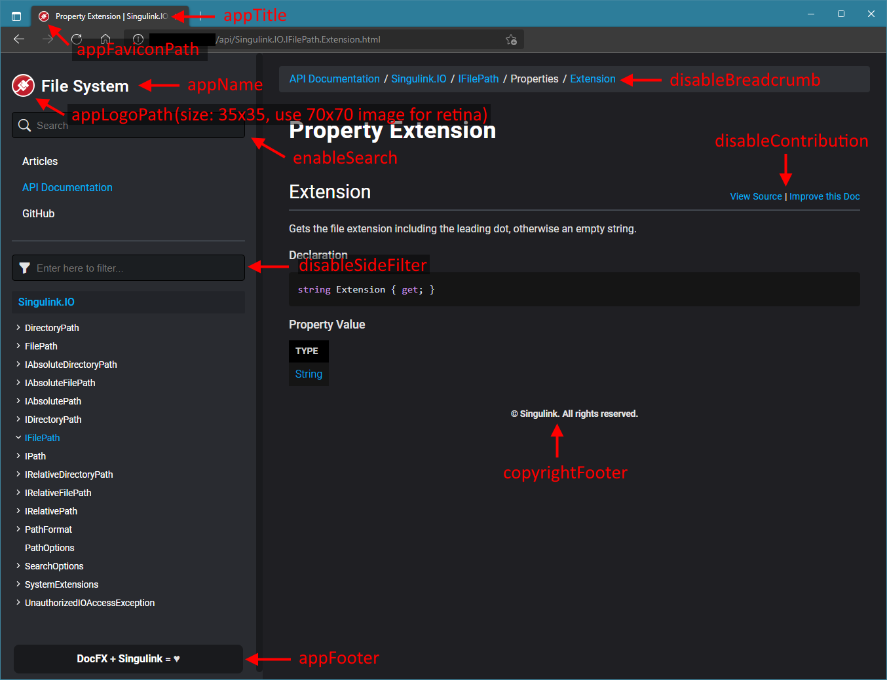
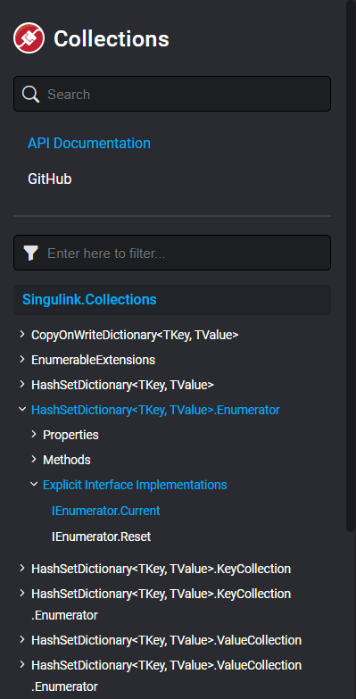
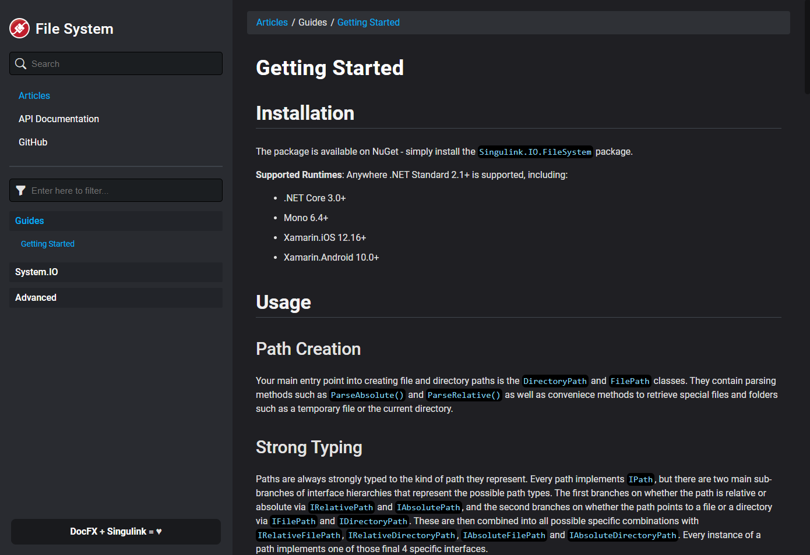
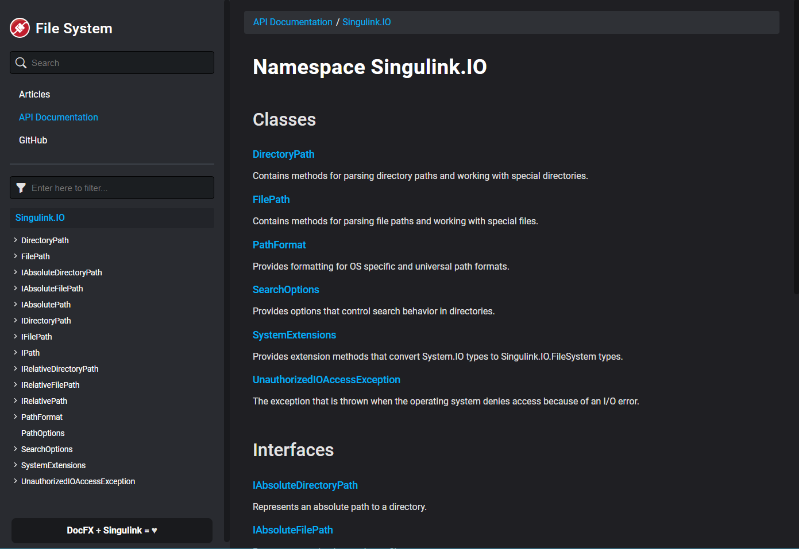
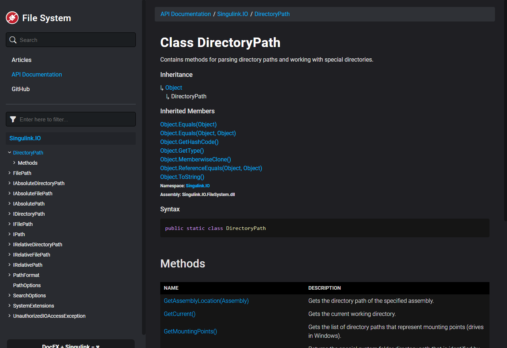
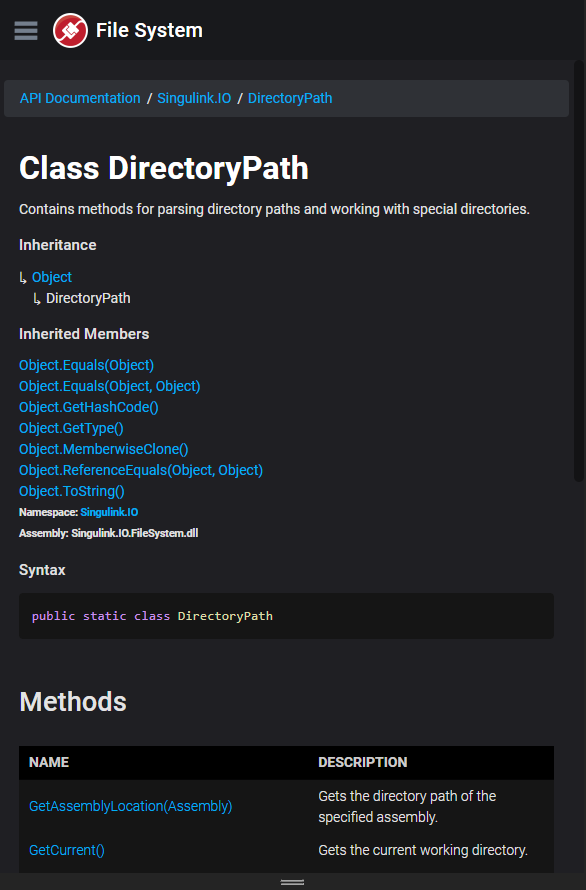
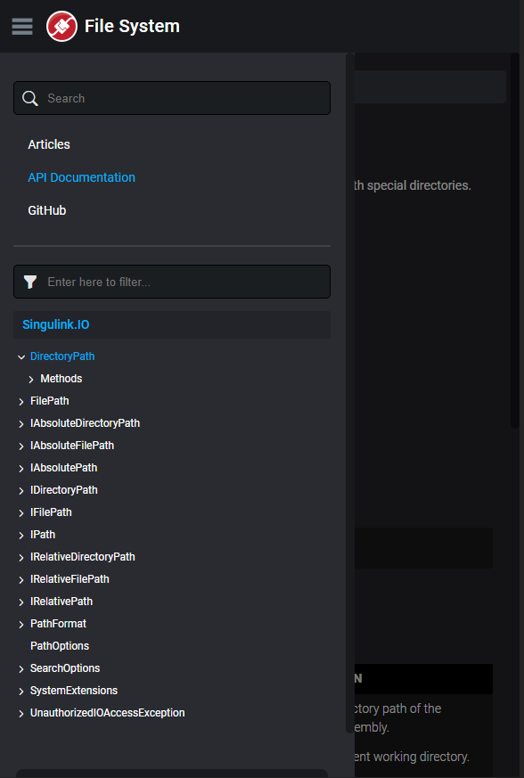

# SingulinkFX

[](https://discord.gg/EkQhJFsBu6)

**SingulinkFX** is a fully responsive [DocFX](https://dotnet.github.io/docfx/) template used for Singulink project documentation. It works beautifully together with the `memberpage` plugin to produce documentation that is familiar to those used to browsing Microsoft's .NET documentation.

**Features:**
- Responsive layout for all device sizes.
- Easily configurable colors and side bar width.
- Empty table columns are removed, so if you don't comment the parameters or return value on some methods then it won't display an empty description column.
- The table of contents supports 4 levels of items to properly facilitate usage together with `memberpage`.
- Optional `memberpage-extras` plugin that improves wrapping behavior of long member names in the table of contents and puts explicit interface implementations into their own section to reduce clutter in the other sections, just like Microsoft's .NET documentation.
- Contains optional style overrides optimized for displaying articles.
- Includes [Bootstrap Icons](https://icons.getbootstrap.com/).

### [Live Demo (Singulink.IO.FileSystem)](https://www.singulink.com/Docs/Singulink.IO.FileSystem/)



### About Singulink

We are a small team of engineers and designers dedicated to building beautiful, functional and well-engineered software solutions. We offer very competitive rates as well as fixed-price contracts and welcome inquiries to discuss any custom development / project support needs you may have.

Visit https://github.com/Singulink to see our full list of publicly available libraries and other open-source projects.

## Installation 

1. Download the source or the zipped file from the [releases page](https://github.com/Singulink/SingulinkFX/releases).
2. In your DocFX project folder, create a new directory named `templates`, if it doesn't already exist.
3. Copy the `singulinkfx` folder from this repository into the `templates` folder.
4. (Optional) [Download the memberpage plugin](https://dotnet.github.io/docfx/templates-and-plugins/plugins-dashboard.html) and follow instructions, place it into a `plugins` folder
5. (Optional) Copy the `memberpage-extras` folder from this repository into the `plugins` folder
6. In your `docfx.json` configuration file, add the `singulinkfx`, `memberpage` and `memberpage-extras` path into the `build.template` property:
   ```json
   "template": ["default", "templates/singulinkfx", "plugins/memberpage.2.59.0/content", "plugins/memberpage-extras"]
   ```

A real-world example of a .NET library using this template with articles, `memberpage` and `memberpage-extras` can be found in the [Singulink.IO.FileSystem](https://github.com/Singulink/Singulink.IO.FileSystem) repository (check out the `Docs` folder). If you are new to DocFX you might also find it helpful for properly setting up the table of contents.

## Customization

### Configuration

The following is a sample `docfx.json` global metadata section that demonstrates the usage of the options this theme offers:
```json
"globalMetadata": {
    "_appTitle": "Singulink.IO.FileSystem",
    "_appName": "File System",
    "_appFaviconPath": "images/favicon.png",
    "_appLogoPath": "images/logo.png",
    "_appFooter": "<strong>DocFX + Singulink = ♥</strong>",
    "_copyrightFooter": "© Singulink. All rights reserved.",
    "_enableSearch": true,
    "_disableSideFilter": false,
    "_enableNewTab": true,
    "_disableContribution": false,
    "_disableBreadcrumb": false,
}
```


### Colors and Layout

You can change any color as well as the width of the side bar and font sizes for desktop and mobile views. The values are defined in the `styles/config.css` file. The recommended approach to changing the default values is to create another directory inside `templates` for your sub-theme that overrides these values in a `styles/main.css` file, and add your theme to the end of the list of templates in `docfx.json`. Your `main.css` file will be automatically referenced in the output, there is no need to override any other template files.

### Custom Javascript

The `styles/main.js` file can be used to add your own custom Javascript. The recommended approach is to create another directory inside `templates` for your sub-theme, add a `styles/main.js` file, and add your theme to the end of the list of templates in `docfx.json`. Your `main.js` file will be automatically referenced in the output, there is no need to override any other template files.

### Article Styling

Wrap your HTML or markdown in a `<div class="article"></div>` to activate styles that change heading styles and spacing to something more suitable for articles instead of API member docs. Supports up to 5 heading levels (`h1` to `h5` for HTML or `#` to `#####` for markdown).

## More Screenshots

### Memberpage-Extras



### Desktop







### Mobile





## Attribution

Special thanks to [@jbltx](https://github.com/jbltx) for creating [DiscordFX](https://github.com/jbltx/DiscordFX) which was a great starting point for this template.